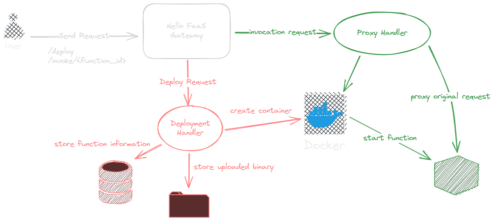

# Hello FaaS

A custom fuction-as-a-Service (Faas) platform that you can deploy your HTTP handler

## What's FaaS?

Function-as-a-service, also know as FaaS, is one important part of serverless architecture. It allows you to deploy your function without worrying about the underlying infrastructure.

## Why FaaS?

- It abstracts away the underlying infrastructure, so developers can focus more on business logic
- Don't need to worry about the traffic
- Only pay for the time that your function is running

## Motivation

- AWS Lambda is cool, and I want to build something similar
- I want to learn more about container orchestration
- I want to write more [Rust](https://www.rust-lang.org)!

## Gateway API

- Upload a compiled binary to deploy a new function
  ```
  POST /deploy
  ```
- Invoke a deployed function
  ```
  GET,POST,,... /invoke/{function_id}
  ```

## Architecture



## About

```
hello-faas
└── The library helping to deploy functions on hello-faas
hello-faas-deploy
└── Command line tool for communicating with the gateway
hello-faas-gateway
└── The gateway of handling deploy request, function invokation, and container orchestration
lambda-http-example
└── Example usage of HTTP handlers on AWS Lambda
```
